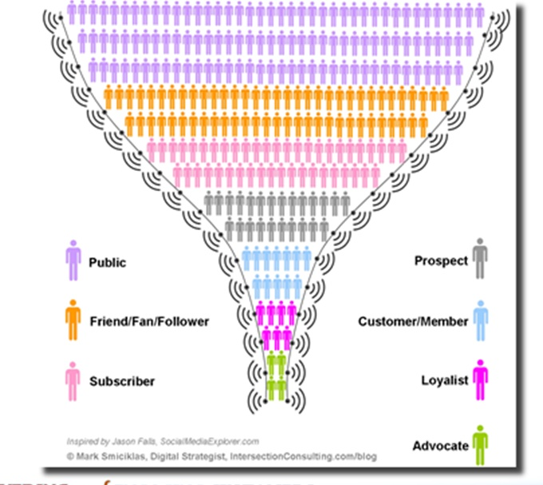

两年前，VC投资者Fred Wilson在他的博客里提出了一个互联网/移动互联网应用的漏斗定律： 30/10/10

* 30%的注册用户或下载应用的人会每月使用服务
* 10%的注册用户或下载应用的人会每天使用服务
* 实时服务的最大并发用户数是日活跃用户的10%

这是作者通过在投资过程中，参考了大量应用的数据总结出来的，主要来自社交网络应用、社交移动应用、游戏、音乐服务以及其他的互联网/移动互联网服务 ，有一定的通用性。我们可以按照通常的数据指标换个说法，一个正常的应用，应该要做到：

* 月活跃度30%
* 日活跃度10%
* 最大并发数1%

也就是说，通过各种渠道和手段将用户吸引进来以后，产品要做到至少让1/3的人能留下来，而留下来的用户中，至少有1/3的人成为忠实用户。最后一条看起来像是给运维工程师评估系统用的，我给它做了个推论，也可以换成业务的转换率，比如对电子商务来说可以是成交转化率，每天的成交用户要做到日活跃用户的10%，也就是总用户数的1%。

当然，因为是比率，在具体的计算时还涉及到分母的数字如何取舍的问题。对于互联网应用，使用注册用户数是准确的；但对于移动互联网应用，下载数的可参考意义并不大，一方面渠道众多，另外一方面下载数很容易被刷，App开发者很难拿到准确的下载数据。所以对于App，可参考的分母应该使用累计用户数(至少启动过一次App的才算是用户）。

Ok，累计用户数这个指标是没问题了，一般App都会使用一些移动统计工具来获得这个数据。如果你的App还没有统计数据的，这里做个广告，建议可以使用我们的“无线数读”服务，全免费的，不费电，链接地址http://wdm.taobao.com

还有另外一个问题，大部分移动统计服务，都是以唯一设备来作为用户统计标准的。根据纽约时报最近的一个报道称，中国人平均6个月更换一次手机，而发达经济体这个时间大约是两年。6个月稍显夸张，所以对于国内的应用，计算累计用户数可以用一年为基准，也就是用最近一年内启动过App的用户数作为累计用户数，来计算上述定律中的数字。

据我所知，一些粘性强的游戏的日活跃度应该是远超过10%，甚至可以达到30%以上。而一些社交App，比如约炮神器这类的，也可以做到超过10%以上，但一些月经类的工具App，则有相当的难度。而且Android用户的活跃度一般都低于iPhone用户。有人愿意分享你所知道的App的数据么？

===== 一零二四的分割线 =====

文章编号 007

* 来自微信公众帐号『数据说话』
* 订阅请使用微信号『DataTalk』

如果已经在微信上关注，你还可以：

* 发送m查看历史文章列表
* 发送编号阅读对应的文章

题图：SocialMediaExplorer.com的Jason Falls制作的一张用户漏斗图

点击“阅读原文”可以查看Fred Wilson的博客原文。
