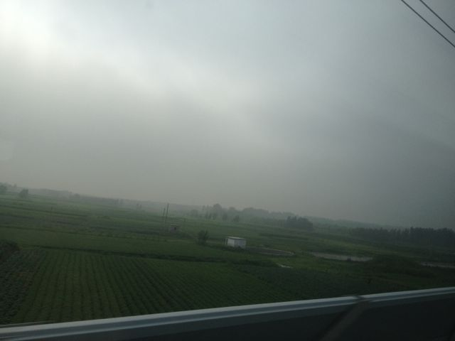

一路向北，高铁进京。

这是第二次坐火车进京，上一次不记得是哪一年了，一群人坐的Z10软卧，一觉睡到京城，体验也挺好的。国内的航班，尤其是进出北京的航班，延误的几率实在是高到不能容忍。杭宁高铁开通以后，不再绕道上海，又节省了一个多小时，现在杭州到北京的高铁，最快的一班已经不到5个小时了。除了价格，从时间成本上来说，也已经有了很强的竞争力。

在开往帝都的高铁上刷微博，又提到了两年前的今天发生在温州的7.23动车事故。两年过去了，反复提起灾难，并不是为了揭开已经结痂的伤疤，更多的是担心同样的事情会发生在我们自己身上。但是至今对这个事情的结论，还是无法让人有安全感。即便如此，我们要抵达远方，依然没有什么更好的选择。公共产品是真正的刚需，要做好这样的产品，需要有制度，也需要有责任心（良心）。

今天发了一条微博：

“微信的故障会影响用户活跃度和忠诚度么？工行的故障会影响用户活跃度和忠诚度么？”

评论是一边倒的“不会”。当一个产品成为生活中不可或缺的时候，偶尔的故障就会被容忍，并且很快被遗忘，淘宝在发展过程中也经历过类似的故障。但如果把用户的这种容忍和遗忘当作理所当然，当有可替代的选择时，肯定无法阻止用户用脚投票。

过了徐州以后，天开始灰暗起来。杭州的夏天虽然经历着高温，却也享受了一段时间的蓝天。渐渐的就以为雾霾已经离我们有点距离了，高铁一路向北才发现还是没有脱离阴影。有新闻说，在近日召开的生态文明贵阳国际论坛2013年年会上，环保部部长周生贤表示，《大气污染防治行动计划》将在7月底8月初发布。

“为了实现《行动计划》确定的目标，整个计划总体投资的需求将近1.7万亿左右，其中包括国家、企业和社会多方面的投入。”

问题是，谁来监督和保证，这个1.7万亿投入是让蓝天重现，而不是再次让物价通胀？

最近，集团上市的风越吹越猛。按照普遍规律，这种事情一般外面的消息会比内部更快更靠谱。只是把IPO的市值这么一路往上吹，对于小到不能再小的普通员工股东来说，也许不是什么好事。IPO的高市值，获益最大的还是大股东、战略投资者和负责承销的投行，小股东只能心理上YY一把罢了。合理的估值上市，继续努力干活推高上市以后的市值，才是小股东可以享受到的蓝天。1688的雾霾，希望不要再现。这个话题太敏感，打住，谢绝跨省。

坐在车上思绪乱飞，感觉也越写越乱了。晚上和昨天在微信上约好的一位朋友聊了聊“无线数读”，很开心做的产品能得到一点认可。

===== 一零二四的分割线 =====

文章编号 008

* 来自微信公众帐号『数据说话』
* 订阅请使用微信号『DataTalk』

如果已经在微信上关注，你还可以：

* 发送m查看历史文章列表
* 发送编号阅读对应的文章

题图：2011.7.23温州动车事故现场

做了十年DBA，容灾已经变成一种习惯。虽然这个微信公众号文章还不多，也做了个备份站点。用Github+Jekyll打造的纯静态页面，可以用markdown写文章，用git提交更新。虽然我不是一个典型的码农，也可以有一颗码农的心。备份地址：http://datashuo.com，点击“阅读原文”可以直接访问。
